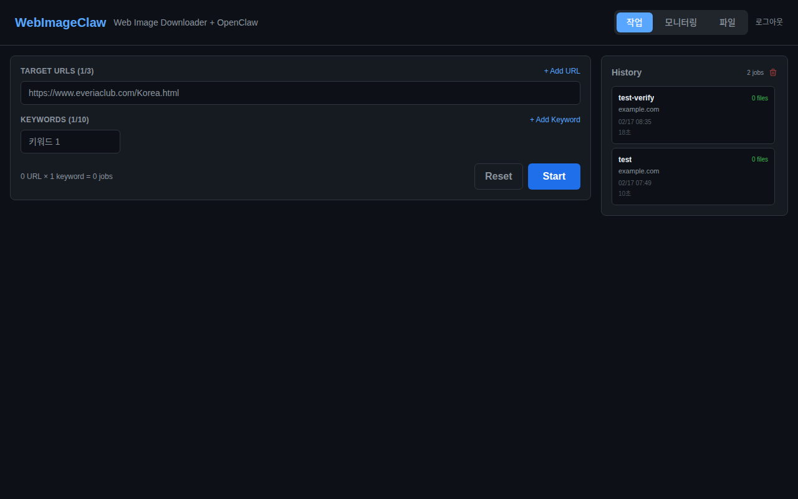
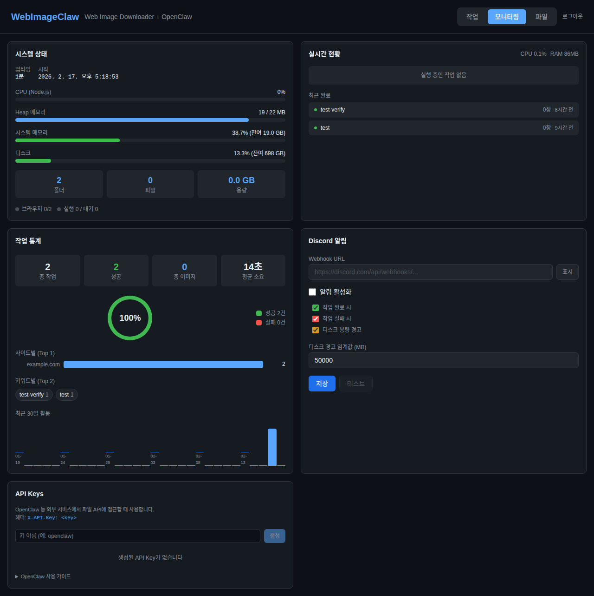

# WebImageClaw

> **v0.2.0** — OpenClaw 연동 웹 드라이브

**OpenClaw lacked a built-in way to download images from websites, which was frustrating — so I built this.**

Tell your OpenClaw Discord bot "download images from this site" and it will automatically browse the website and save images to your PC. Use the **Web Drive** to manage downloaded files remotely — search, sort, preview, share, copy/move — all from your browser or through OpenClaw commands.

```
In Discord:
  You: "@MartinClaw download landscape images from https://example.com/gallery"
  Bot: "Done! Downloaded 1,523 images in 45 minutes 12 seconds."

  You: "@MartinClaw show my downloaded files"
  Bot: "📁 landscape/ (1,523 files), portrait/ (892 files), ..."
```

---

## Screenshots

| Scraping Dashboard | Monitoring & API Keys |
|:--:|:--:|
|  |  |

---

## How It Works

```
Discord / Telegram User
  -> OpenClaw Bot (MartinClaw)
    -> exec webclaw start <URL> <keyword>
      -> WebImageClaw Server (running on your PC)
        -> Chrome browses the website
        -> Automatically downloads images
      <- Progress / result report
    <- "Done! 1,523 images downloaded"
```

- **OpenClaw**: AI assistant for Discord, WhatsApp, Telegram, etc. ([openclaw.ai](https://openclaw.ai))
- **WebImageClaw**: Website image scraper with dashboard (this project)
- **webclaw CLI**: Command-line tool that bridges OpenClaw and WebImageClaw

---

## Features

### Image Scraping
- **Batch Image Download** — Enter a URL and keyword to collect all matching images
- **Smart Page Navigation** — Follows pagination, galleries, and sub-pages
- **Lazy-load Aware** — Scrolls to trigger lazy content, parses `data-src` and `srcset`
- **High-fidelity Capture** — Chrome DevTools Protocol captures full-resolution originals
- **Duplicate Filtering** — Skips thumbnails, icons, and duplicates by size/pattern
- **Job Queue** — 2 concurrent jobs with automatic queuing

### Web Drive (v0.2)
- **Grid / List View** — Toggle between image thumbnail grid and detailed file list
- **Search & Sort** — Find files by name, sort by name/size/date
- **Share Links** — Generate temporary share URLs for files (token-based, 24h expiry)
- **Copy & Move** — Copy or move files/folders between directories
- **Context Menu** — Right-click for quick actions (copy, move, delete, share)
- **Drag & Drop Upload** — Drop files directly into the browser to upload
- **Image Preview** — Click to view full-size images with zoom
- **OpenClaw Web Drive** — Manage files remotely via Discord/Telegram bot commands

### Monitoring & Management
- **System Monitoring** — Real-time CPU, memory, disk, Puppeteer status
- **Job Statistics** — Success rate donut, site/keyword charts, 30-day activity graph
- **Discord Alerts** — Webhook notifications for completion, failure, and disk warnings
- **ZIP Export** — Download selected files as .zip archive
- **History Management** — Persistent history with bulk clear

### Security & Remote Access
- **Admin Authentication** — Password-protected dashboard (bcrypt + JWT)
- **API Keys** — `wih_` prefixed keys for external service access
- **Path Traversal Protection** — All file operations validated against downloads directory
- **Remote Dashboard** — Access via VPN to manage files from anywhere

### OpenClaw Integration
- **webclaw CLI** — Zero-dependency CLI (Node.js built-in `http` only) for Docker sandbox compatibility
- **Auto Server Discovery** — localhost > host.docker.internal > Docker gateway > bridge IPs
- **API Key Auth** — `WEBCLAW_API_KEY` env var or `~/.webclaw-key` file
- **Auto Provisioning** — `setup-openclaw.js` installs CLI, configures OpenClaw, generates API key

---

## Requirements

| Requirement | Minimum Version | How to Check |
|-------------|-----------------|--------------|
| **Node.js** | v18+ | `node --version` |
| **npm** | v9+ | `npm --version` |
| **Google Chrome** or **Chromium** | Latest | Auto-detected if installed |
| **OpenClaw** (optional) | Latest | `openclaw --version` |

### Supported Operating Systems

| OS | Server | Desktop App | OpenClaw Integration |
|----|--------|-------------|----------------------|
| **Windows 10/11** | Yes | Yes | Yes |
| **macOS 12+** | Yes | Yes | Yes |
| **Ubuntu/Debian** | Yes | Yes | Yes |
| **Other Linux** | Yes | Yes | Yes |

---

## Installation Guide

### Step 1: Download WebImageClaw

```bash
git clone https://github.com/wpulnbada-vr/webimage-claw.git
cd webimage-claw
npm install

# Build the frontend
cd frontend && npm install && npm run build && cd ..
```

### Step 2: Start the Server

```bash
npm start
```

Open `http://localhost:3100` in your browser. On first access, set an admin password.

**Verify the server is running:**
```bash
curl http://localhost:3100/api/health
# Response: {"status":"ok","version":"0.2.0",...}
```

### Step 3: Use the Dashboard

| Tab | Description |
|-----|-------------|
| **Jobs** | Enter URLs, start scraping, view real-time progress and history |
| **Monitoring** | System metrics, job statistics, Discord alerts, API key management |
| **Files** | Browse downloads, upload/delete files, download as ZIP (requires login) |

---

## OpenClaw Integration Guide

### Prerequisites

1. **OpenClaw installed and configured**
   ```bash
   curl -fsSL https://openclaw.ai/install.sh | bash
   openclaw onboard
   ```

2. **WebImageClaw server running**
   ```bash
   npm start
   ```

### Automatic Setup

```bash
npm run setup:openclaw
```

This command:
- Installs `webclaw` CLI to `~/.local/bin/`
- Configures OpenClaw's `openclaw.json` with `pathPrepend`
- Updates workspace `TOOLS.md` and `SOUL.md`
- Generates an API key and saves to `~/.webclaw-key`

**Docker sandbox mode:**
```bash
npm run setup:openclaw:sandbox
```

### Manual Setup

**1. Install the webclaw CLI:**
```bash
mkdir -p ~/.local/bin
cp src/cli/webclaw.js ~/.local/bin/webclaw.js
cat > ~/.local/bin/webclaw << 'EOF'
#!/bin/bash
exec node "$(dirname "$0")/webclaw.js" "$@"
EOF
chmod +x ~/.local/bin/webclaw ~/.local/bin/webclaw.js
```

**2. Edit OpenClaw config** (`~/.openclaw/openclaw.json`):
```json
{
  "tools": {
    "exec": {
      "pathPrepend": ["~/.local/bin"]
    }
  }
}
```

**3. Generate an API key** from the Dashboard > Monitoring > API Keys section, then save it:
```bash
echo "wih_your_key_here" > ~/.webclaw-key
chmod 600 ~/.webclaw-key
```

**4. Restart OpenClaw gateway:**
```bash
openclaw gateway --force
```

### Testing

```bash
webclaw list                    # Direct CLI test
webclaw files /                 # List files (requires API key)
```

---

## Running as a Linux Service

```bash
sudo cp webimage-claw.service /etc/systemd/system/
sudo nano /etc/systemd/system/webimage-claw.service  # Edit User and paths
sudo systemctl daemon-reload
sudo systemctl enable webimage-claw
sudo systemctl start webimage-claw
```

---

## Docker Environment

If OpenClaw runs inside a Docker sandbox, allow containers to reach port 3100:

```bash
# UFW
sudo ufw allow from 172.16.0.0/12 to any port 3100 proto tcp comment 'WebImageClaw Docker access'
```

### Server Discovery Order

1. `WEBCLAW_SERVER` environment variable
2. `http://localhost:3100`
3. `http://host.docker.internal:3100` (Docker Desktop)
4. Docker default gateway IP (auto-parsed from `/proc/net/route`)
5. `http://172.17.0.1:3100` (Docker bridge)

---

## Command Reference

### Server

```bash
npm start                      # Start server (port 3100)
PORT=3200 npm start            # Start on a different port
npm run electron               # Start as Electron desktop app
```

### webclaw CLI

```bash
webclaw start <URL> [keyword]  # Start scraping
webclaw status [jobId]         # Check job status
webclaw list                   # List recent jobs
webclaw files [path]           # List downloaded files (requires API key)
```

### API Endpoints

| Method | Path | Auth | Description |
|--------|------|:----:|-------------|
| GET | `/api/health` | | Server health check |
| POST | `/api/scrape` | | Start scraping (`{url, keyword}`) |
| GET | `/api/jobs` | | List active jobs |
| GET | `/api/jobs/:id/summary` | | Job summary (plain text) |
| GET | `/api/progress/:id` | | Progress SSE stream |
| GET | `/api/history` | | Full history |
| DELETE | `/api/history` | | Clear all history |
| POST | `/api/abort/:id` | | Abort a job |
| GET | `/api/auth/status` | | Auth status |
| POST | `/api/auth/setup` | | Initial password setup |
| POST | `/api/auth/login` | | Login (returns JWT) |
| GET | `/api/auth/api-keys` | Yes | List API keys |
| POST | `/api/auth/api-keys` | Yes | Generate API key |
| GET | `/api/filemanager?path=` | Yes | List directory |
| POST | `/api/filemanager/upload` | Yes | Upload files |
| POST | `/api/filemanager/mkdir` | Yes | Create folder |
| POST | `/api/filemanager/copy` | Yes | Copy file/folder |
| POST | `/api/filemanager/move` | Yes | Move file/folder |
| POST | `/api/filemanager/share` | Yes | Generate share link |
| GET | `/api/filemanager/shared/:token` | | Access shared file |
| DELETE | `/api/filemanager?path=` | Yes | Delete file/folder |
| POST | `/api/filemanager/download-zip` | Yes | Download as ZIP |
| GET | `/api/monitor/system` | | System metrics |
| GET | `/api/monitor/stats` | | Job statistics |

### Build

```bash
npm run build:frontend          # Build frontend
npm run build:win               # Windows installer
npm run build:linux             # Linux package
```

---

## Troubleshooting

### "Cannot find WebImageClaw server"
- Check if the server is running: `curl http://localhost:3100/api/health`
- Start it if not: `cd webimage-claw && npm start`
- In Docker: check firewall rules (see Docker section above)

### "Chrome not found"
- Install Google Chrome or Chromium
- Specify manually: `CHROME_PATH=/usr/bin/google-chrome npm start`
- The Electron desktop app downloads Chrome automatically

### OpenClaw bot not responding
- Check gateway status: `openclaw status`
- Verify the `exec` tool is enabled
- If `groupPolicy` is `"allowlist"`, add your guild ID to the config

---

## Project Structure

```
webimage-claw/
├── src/
│   ├── core/                 # Core engine
│   │   ├── scraper.js        # Image scraper (Puppeteer + CDP)
│   │   ├── job-manager.js    # Job queue management
│   │   ├── auth.js           # Authentication (bcrypt + JWT + API keys)
│   │   ├── filemanager.js    # File management API
│   │   ├── monitor.js        # System monitoring + Discord alerts
│   │   ├── chrome-finder.js  # Cross-platform Chrome detection
│   │   └── constants.js      # Constants
│   ├── server/               # Express API server
│   │   ├── index.js          # Server entry point
│   │   └── routes/           # API routes
│   ├── desktop/              # Electron desktop app
│   │   ├── main.js           # Main process
│   │   ├── preload.js        # IPC bridge
│   │   └── chrome-manager.js # Chrome download manager
│   └── cli/
│       └── webclaw.js        # OpenClaw CLI tool (zero dependencies)
├── frontend/                 # React 19 + Vite 6 + Tailwind CSS v4
├── public/                   # Frontend build output
├── scripts/
│   └── setup-openclaw.js     # OpenClaw integration + API key setup
├── openclaw/
│   └── webclaw.js            # CLI copy for OpenClaw workspace
├── downloads/                # Downloaded images (git-ignored)
├── webimage-claw.service     # systemd service file
├── electron-builder.yml      # Electron build config
└── package.json
```

---

## License

MIT License

---

*WebImageClaw v0.2 — Image scraper + web drive, powered by OpenClaw.*
